<div align="center">
  
</div>

<br>

```
Results-driven Software Engineer with a Bachelor of Technology in Computer Science
and specialized experience in data analysis and AI. Proficient in Python, TensorFlow,
and PyTorch, with a proven track record of transforming complex datasets into actionable
insights and optimizing system performance. Experienced in developing cloud-native
solutions and AI-powered platforms.
```

<p align="left">  </p>

---

<h3>⚡ Tech Stack</h3>

<details open>
<summary><b>🖥️ Development & Architecture</b></summary>
<br>


</details>

<details open>
<summary><b>🧠 Data Science & Machine Learning</b></summary>
<br>


</details>

<details open>
<summary><b>☁️ Cloud & Infrastructure</b></summary>
<br>


</details>

<details open>
<summary><b>🗄️ Databases</b></summary>
<br>


</details>

<details open>
<summary><b>🔧 Tools & Collaboration</b></summary>
<br>


</details>

---

<h3>📫 Connect</h3>

<p align="left">
<a href="https://www.linkedin.com/in/hemal-shingloo-a21023238" target="blank"></a>
<a href="https://medium.com/@shingloo55" target="blank"></a>
<a href="mailto:shingloo55@gmail.com"></a>
</p>

---

<h3>📊 GitHub Stats</h3>

<p align="center">
  <a href="https://git.io/streak-stats"></a>
</p>
<p align="center">
  
</p>
<p align="center">
  
</p>

<br>

<p align="center">
  
</p>
